> Team name: kafka
> 
> GitHub project: https://github.com/Oceankj/kafka
> 
> Members: Ching Kao

# Introduction

This project is focus on testing the client side of [`Apache/kafka`](https://github.com/Oceankj/kafka). The client side include the Producter and the Consumer, which are widely used in modern data streaming and AI data pipelines.

**environment:** jvm 17+

**Main Use Cases:**
- **Messaging:** Facilitates decoupled communication by sending events between services.
- **Stream Processing:** Enables real-time data processing and analytics.
- **Event Storage:** Maintains a replayable log of events, supporting auditing and recovery.

## What is kafka?
Apache Kafka is a popular event streaming platform used to collect, process, and store streaming event data or data that has no discrete beginning or end. Kafka makes possible a new generation of distributed applications capable of scaling to handle billions of streamed events per minute. [Source: Google Cloud](https://cloud.google.com/learn/what-is-apache-kafka?hl=en#what-are-the-benefits-of-kafka)

It is widely used in microservices architectures, IoT, clickstream analytics, and real-time machine learning pipelines.


## Key Components

### Broker
A **Broker** is a Kafka server node responsible for storing data, managing topics and partitions, and handling read and write requests from clients (producers and consumers). Kafka clusters typically consist of multiple brokers, ensuring scalability and fault tolerance.

### Client
Kafka clients are categorized as **Producers** and **Consumers**:
- **Producer:** Sends (publishes) events to Kafka topics.
- **Consumer:** Reads (subscribes to) events from Kafka topics.

Producers and consumers are completely decoupled: producers are not aware of the consumers, and multiple consumers can independently read the same data.

we can compare it to a logistics system:

| Kafka Component | Analogy            | Kafka Role/Description                                                                                          |
|-----------------|--------------------|-----------------------------------------------------------------------------------------------------------------|
| Producer        | Sender             | Person who ships packages. In Kafka, producers generate and send messages.                                      |
| Consumer        | Receiver           | Person who receives packages. Consumers read and process messages.                                              |
| Topic           | Package Category   | All packages are sorted by their type or destination. In Kafka, a topic is a category or feed name for messages.|
| Broker          | Warehouse          | Physical facility where packages are stored, received, and dispatched. In Kafka, a broker stores and serves data.|

***Hint:** Unlike physical packages in a logistics system, Kafka messages are immutable
records stored in a log and can be consumed multiple times by different consumers.*

## Why Focus Only on the Client Side in This Project?

Testing the client side of Kafka (i.e., the Producer and Consumer) allows us to concentrate on application logic and business-driven testing, without being hindered by the complexities of Kafka’s distributed broker cluster.

**Kafka Cluster Complexity:**
- A typical Kafka deployment consists of multiple broker nodes (each running in a separate JVM, usually on different machines) that work together as a cluster.
- The broker layer introduces additional challenges related to:
    - Replication (copies of data across brokers)
    - Leader election (deciding which broker handles reads/writes for a partition)
    - Network communication and performance
    - Disk I/O and storage availability

**Testing Challenges with Brokers:**
- When tests involve the full Kafka broker infrastructure, failures can be hard to diagnose:
    - Is the test failing due to an issue in test code?
    - Is there a timing or synchronization problem?
    - Is it an infrastructure issue (network, disk, cluster instability)?

Focusing on the client side helps us avoid spending excessive time keeping the whole system running, and lets us put effort into verifying behavior rather than troubleshooting infrastructure.

## Which Files Should We Focus On, and Why?

### 1. Client-Side Code: Producer & Consumer

The primary focus should be on testing the Kafka client components: the **Producer** and **Consumer**. These components are essential because, in most industry scenarios, up to 80% of direct Kafka usage centers around sending and receiving messages, not managing brokers or infrastructure.

**Relevant Code Paths:**
```
clients/
├── clients-integration-tests
├── src/main/java/org/apache/kafka/clients/
│   ├── producer/                # Producer client implementation
│   ├── consumer/                # Consumer client implementation
│   ├── admin/
│   └── CommonClientConfigs.java
└── src/test/java/               # Unit tests for clients
```

By narrowing our attention to these folders, we can design and execute tests that are directly aligned with industry best practices and typical usage patterns.

---

### 2. Official Test Cases

Kafka's official repository includes a comprehensive suite of test files. These are invaluable for supplementing our own tests and provide thorough coverage, including:

- **System Integration & Performance Testing:**  
  Located in the root-level `tests` directory—these typically require a running Kafka cluster (often managed with Docker).
- **Unit Tests:**  
  Embedded within each major directory: `./core`, `./clients`, `connect`, etc.—each contains targeted unit tests for their respective modules.

**Representative Test Commands:**
```shell
./gradlew test                         # Runs all unit and integration tests
./gradlew unitTest                     # Runs only unit tests
./gradlew integrationTest              # Runs only integration tests
./gradlew test -Pkafka.test.run.flaky=true  # Includes "flaky" (

# we focus on
./gradlew :clients:test
```

---

**Summary:**  
Concentrate on the `clients/` module, specifically the Producer and Consumer subdirectories, when writing and running tests for this project. Enhance coverage and robustness by leveraging the official unit and integration test suites provided by Kafka, utilizing the given Gradle commands for different test scopes.


## How to test?

**Testing Approach: Maximizing Value, Minimizing Infrastructure**

We do not always need to start a full Kafka environment to test Kafka-related code. When environment setup is required, we should aim for the smallest viable Kafka architecture to maximize test value while minimizing infrastructure overhead.

---

### A. Running Only Unit Tests (Clients Module)

- **No Kafka broker required**
- Only compile and test code within the `clients` module—fast and efficient for rapid iteration

**Command:**
```shell
./gradlew :clients:unitTest
```
*Gradle will automatically build and test only the clients module; we do not need to build the entire Kafka project.*

---

### B. Running Integration / End-to-End Tests (Producer → Broker → Consumer)

- **Requires a running Kafka broker** (local or Docker)
- **Topic creation required**
- **Build the `clients` module**, possibly others (e.g. `core`)

```
[Test Code / App]
      |
  Producer
      |
   Topic
      |
  Consumer
```


**Commands:**
```shell
./gradlew build                   # Build the entire Kafka project
./gradlew :clients:integrationTest
```
*Building ensures that necessary classes/jars are generated for Producer and Consumer execution.*


**Testing Focus:**
- Correctness of data transmission
- Stability and behavior of the consumer

**Not the focus:**
- Routing logic
- Multi-topic architecture


### How to Run an End-to-End Kafka Test?


#### Step 1: Start a Kafka Broker

We recommend using Docker for simplicity. The following command will launch a Kafka broker and its required dependencies:

```bash
docker run -d --name kafka \
  -p 9092:9092 \
  -e KAFKA_ADVERTISED_HOST_NAME=localhost \
  -e KAFKA_ZOOKEEPER_CONNECT=localhost:2181 \
  wurstmeister/kafka:latest
```

#### Step 2: Create a Kafka Topic

Both the producer and consumer need to know the topic name. Create a topic called `test-topic` (or any name you prefer) with the following command:

```bash
./bin/kafka-topics.sh --create \
  --topic test-topic \
  --bootstrap-server localhost:9092 \
  --partitions 1 \
  --replication-factor 1
```

- Here, we use a single partition and a replication factor of 1 for a simple environment.

#### Step 3: Implement a Simple Producer and Consumer

Set up a small, separate Java project for your tests, apart from the main Kafka source code. The structure might look like this:

```
kafka/                  ← Our forked Kafka source code
kafka-playground/       ← Our test project (new)
  ├─ build.gradle
  └─ src/main/java/
     └─ demo/
        ├─ SimpleProducer.java
        └─ SimpleConsumer.java
```

**SimpleProducer.java**

```java
package demo;

import org.apache.kafka.clients.producer.*;
import java.util.Properties;

public class SimpleProducer {
    public static void main(String[] args) {

        Properties props = new Properties();
        props.put("bootstrap.servers", "localhost:9092");
        props.put("key.serializer",
                "org.apache.kafka.common.serialization.StringSerializer");
        props.put("value.serializer",
                "org.apache.kafka.common.serialization.StringSerializer");

        KafkaProducer<String, String> producer =
                new KafkaProducer<>(props);

        producer.send(
                new ProducerRecord<>("test-topic", "key1", "Hello Kafka!")
        );

        producer.close();
        System.out.println("Message sent");
    }
}
```

**SimpleConsumer.java**

```java
package demo;

import org.apache.kafka.clients.consumer.*;
import java.time.Duration;
import java.util.*;

public class SimpleConsumer {
    public static void main(String[] args) {

        Properties props = new Properties();
        props.put("bootstrap.servers", "localhost:9092");
        props.put("group.id", "test-group");
        props.put("auto.offset.reset", "earliest");
        props.put("key.deserializer",
                "org.apache.kafka.common.serialization.StringDeserializer");
        props.put("value.deserializer",
                "org.apache.kafka.common.serialization.StringDeserializer");

        KafkaConsumer<String, String> consumer =
                new KafkaConsumer<>(props);

        consumer.subscribe(Collections.singletonList("test-topic"));

        while (true) {
            ConsumerRecords<String, String> records =
                    consumer.poll(Duration.ofMillis(100));

            for (ConsumerRecord<String, String> record : records) {
                System.out.printf(
                        "Received: key=%s value=%s%n",
                        record.key(), record.value()
                );
            }
        }
    }
}
```

# Partitioning

## What the need for systematic functional testing and partition testing?

### The Limitation of Structural (White Box) Testing

While Structural testing ensures that the written code is executed correctly, it suffers from "blind spots."

- **Missing Logic:** Testing will never focus on code that isn’t there!. Structural testing will report 100% coverage, while the system remains broken.
- **Requirement Blindness:** Structural testing focuses on how the program works, not what it is supposed to do.

### The Role of Systematic Functional Testing (Black Box)

Systematic Functional Testing is a "black-box" method that checks whether a system behaves according to its documented requirements. It has the following characteristics:

- **Bridging the Gap:** By comparing the software’s behavior to these requirements, it helps find missing features or rules that might have been overlooked.
- **Specification-driven:** It ensures that the system provides the correct output for a given input, regardless of the internal implementation.

### The Necessity of Partition Testing

Since we cannot test every possible input, we need a systematic way to select test cases.

- **Efficiency:** Partition testing divides the input data into logical groups (partitions). We assume that if one value in a partition works, all others in that same partition will also work.
- **Maximizing Coverage:** It allows us to achieve high confidence in the software's reliability using a minimum number of test cases, saving time and computational resources.
- **Error Detection:** By focusing on boundaries between partitions (Boundary Value Analysis), we are more likely to find bugs where the logic typically fails (e.g., using > instead of >=).

#### Example: Shipping Cost Calculation

Function: `calculate_total_cost(weight, distance)`

- Distances up to 100 are billed at one rate, up to 500 are billed
at another rate, and beyond that are at the highest rat
- Weights 10 or more are in one rate, 5 or more (but less than
the first rate) are another rate, 1 or more at another rate, and
less than 1 at the lowest rate

1. Distance (Integer Boundaries)

| Partition Name | Range         | Boundary Inclusion                  | 
|----------------|--------------|-------------------------------------|
| Lowest Rate    | `[0, 100]`     | Includes 0 and 100                  |
| Middle Rate    | `(100, 500]`   | Excludes 100, includes 500          |
| Highest Rate   | `(500, ∞)`     | Anything above 500                  |

1. Weight (3-Decimal Precision Boundaries)
  
| Partition Name   | Range      | Boundary Inclusion                    | 
|------------------|------------|---------------------------------------|
| Lowest Rate      | `[0, 1)`     | Includes 0, up to but not including 1.000 |
| Tier 2 Rate      | `[1, 5) `    | Includes 1.000, up to but not including 5.000 |
| Tier 3 Rate      | `[5, 10)`    | Includes 5.000, up to but not including 10.000 | 
| Highest Rate     | `[10, ∞) `   | Includes 10.000 and above             | 

## Selected Feature 1 - linger.ms

The selected feature is the `linger.ms` configuration in Kafka Producer, which controls how long the producer waits before sending a batch of records.


> ... This setting defaults to 0 (i.e. no delay). Setting linger.ms=5, for example, would have the effect of reducing the number of requests sent but would add up to 5ms of latency to records sent in the absence of load. [Apache Kafka Document](https://kafka.apache.org/31/configuration/producer-configs/?utm_source=chatgpt.com)

According to the Apache Kafka official documentation, the `linger.ms` producer configuration parameter controls how long the producer will wait for additional records before sending a batch. The default value is 0, indicating no intentional delay; increasing this value enables batching at the cost of latency. This official behavior provides a basis for selecting boundary values such as 0, small positive values (e.g., 1–5 ms), moderate values (e.g., 50 ms), and large values (e.g., 1000 ms) for testing.

| Setting                        | Behavior                               |
| ------------------------------ | -------------------------------------- |
| `0`                            | No intentional delay, send immediately |
| small ms (e.g., `5`)           | Some delay, enables batching           |
| larger ms (e.g., `50`, `1000`) | Larger wait window for batching        |

### Partitioning scheme

The partitions are defined as follows:

- Partition 1: Elapsed time is less than `linger.ms`
  - `elapsedTime` = `[0,linger.ms)`
- Partition 2: Elapsed time is exactly equal to `linger.ms`
  - `elapsedTime` = `[linger.ms]`
- Partition 3: Elapsed time is greater than `linger.ms`
  - `elapsedTime` = `(linger.ms,∞)`

The boundary occurs at the point where elapsed time equals linger.ms.

### How those partitions are different?

These partitions differ in whether the batch is considered ready to be sent.

In Partition 1, the linger time has not yet expired, so the batch should not be ready.
In Partition 2 and Partition 3, the linger time has reached or exceeded the configured threshold, so the batch is expected to be marked as ready.

### Representative input values 

For the purpose of boundary value analysis, linger.ms was fixed at 10 ms.

This value was chosen because it is a valid, non-special configuration that allows clear observation of behavior immediately below, at, and above the boundary, while keeping test execution time short.

- Partition 1 → elapsed time = 9 ms 
- Partition 2 → elapsed time = 10 ms 
- Partition 3 → elapsed time = 11 ms

### Test cases

These boundary value tests for `linger.ms` are designed to verify the readiness logic of `RecordAccumulator` based solely on elapsed time.

To ensure that only elapsed time influences the readiness outcome, the accumulator is set up with a large `batchSize` (1024 bytes) and `totalSize` (16384 bytes). This prevents batch size limits or memory constraints from triggering readiness, isolating the time-based effect of `linger.ms`.

The accumulator is constructed via the `createTestRecordAccumulator` helper, which uses standardized defaults consistent with the Kafka test suite. This approach ensures correct configuration while keeping test setup concise and consistent.

Precise time control is achieved using `MockTime`. Each test records the initial timestamp when a record is appended by calling `time.milliseconds()`. The passage of time is then simulated, and the readiness of the accumulator is checked via the `ready()` method at specific elapsed intervals, enabling exact boundary evaluation without reliance on actual clock time.

A single record is appended in each test, and all other readiness criteria are made non-restrictive. This guarantees that the observed readiness transitions are determined exclusively by whether the elapsed time is just below, exactly at, or just above the configured `linger.ms` value.

| Test name                          | Elapsed time relative to `linger.ms` | Expected readiness | Purpose                                        |
| ---------------------------------- | ------------------------------------ | ------------------ | ---------------------------------------------- |
| `testElapsedTimeJustBelowLingerMs` | `elapsedTime < linger.ms`            | Not ready          | Verifies that batches are not sent prematurely |
| `testElapsedTimeAtLingerMs`        | `elapsedTime = linger.ms`            | Ready              | Validates the exact boundary condition         |
| `testElapsedTimeAboveLingerMs`     | `elapsedTime > linger.ms`            | Ready              | Confirms stable readiness beyond the boundary  |


#### How to Run the Tests

To execute the boundary value tests for `linger.ms`, use the following command from the Kafka project root directory:

```bash
./gradlew :clients:test \
  --tests "org.apache.kafka.clients.producer.internals.RecordAccumulatorTest.testElapsedTimeJustBelowLingerMs" \
  --tests "org.apache.kafka.clients.producer.internals.RecordAccumulatorTest.testElapsedTimeAtLingerMs" \
  --tests "org.apache.kafka.clients.producer.internals.RecordAccumulatorTest.testElapsedTimeAboveLingerMs" \
  -x checkstyleTest
```

> Note: The `-x checkstyleTest` flag disables Checkstyle checks, allowing test execution to focus solely on verifying functionality.

## Selected Feature 2 - batch.size

> The producer will attempt to batch records together into fewer requests whenever multiple records are being sent to the same partition. This helps performance on both the client and the server. This configuration controls the default batch size in bytes.
>
> No attempt will be made to batch records larger than this size.
> 
> ... This setting gives the upper bound of the batch size to be sent. ... [Apache Kafka Document](https://kafka.apache.org/31/configuration/producer-configs/#producerconfigs_batch.size)

The `batch.size` parameter sets the upper limit (in bytes) for a record batch.

This property is ideal for boundary value analysis because the key points occur when the total bytes of records approach, match, or slightly exceed batch.size. This allows observation of how the accumulator accepts records at and around this boundary, ensuring that both normal and oversized records are handled correctly.

### Partitioning scheme

**Partition 1:** The total size of records in the batch is less than the configured `batch.size`.
- `recordSize < batch.size`

**Partition 2:** The total size of records in the batch exactly matches the `batch.size`.
- `recordSize == batch.size`

**Partition 3:**  The total size of records in the batch exceeds the `batch.size`.
- `recordSize > batch.size`

**Boundary value:** `recordSize = batch.size`

### How those partitions are different?

**Partition 1: Below Boundary**  
The batch remains **Not Ready**. It stays in memory until either more records are added (potentially reaching the boundary) or a timeout (`linger.ms`) occurs.

**Partition 2: At Boundary**  
The batch accepts a record that fills it to the maximum allowed payload. The record is successfully appended, but the batch may not immediately appear as ready until the next append or flush.

**Partition 3: Above Boundary**  
A single record exceeding the batch size is accepted by the accumulator and placed in a new batch. This ensures that large records are handled correctly without being split.

### Representative input values 

For boundary value analysis, the `batch.size` was set to **1024 bytes**.

**Why Choosing 1024 Bytes:**
- It is a practical, standard configuration.
- The size is sufficient to avoid edge scenarios with very small batches.
- Record sizes near this value are easy to control and reason about.

**Selected Representative Input Values:**

| Partition     | Record Size | Relation to batch.size       |
|---------------|-------------|-----------------------------|
| Partition 1   | 1023 bytes  | Just below the boundary     |
| Partition 2   | 1024 bytes  | Exactly at the boundary     |
| Partition 3   | 1025 bytes  | Just above the boundary     |

### Test cases

The following boundary value tests for `batch.size` focus on assessing the behavior of the `RecordAccumulator` as batches approach, hit, or slightly exceed the configured size threshold.

To isolate the impact of batch size—and exclude confounding effects from time or overall memory constraints—the accumulator is set up with a high `linger.ms` value (60,000 ms) and generous total memory (16,384 bytes). This setup ensures that batch readiness is triggered only by reaching the `batch size` limit.

The accumulator is constructed via the `createTestRecordAccumulator` helper, which uses standardized defaults consistent with the Kafka test suite. This approach ensures correct configuration while keeping test setup concise and consistent.

Each individual test appends a record with a payload size crafted so the total batch size lands just below, precisely at, or just above the `batch.size` limit. Careful calculation of the payload—accounting for record overhead—ensures accurate coverage of boundary conditions.

Batch readiness is detected using the `RecordAppendResult.future`, rather than solely inspecting `readyNodes`. This reflects Kafka's real batch processing behavior, where immediate readiness may not coincide exactly with boundary conditions. Using this method confirms that the record acceptance logic at each boundary is determined purely by the batch's byte size in relation to the configured `batch.size`.

#### How to Run the Tests

To execute the boundary value tests for `linger.ms`, use the following command from the Kafka project root directory:

```bash
./gradlew :clients:test \
  --tests "org.apache.kafka.clients.producer.internals.RecordAccumulatorTest.testBatchSizeJustBelowBoundary" \
  --tests "org.apache.kafka.clients.producer.internals.RecordAccumulatorTest.testBatchSizeExactlyAtBoundary" \
  --tests "org.apache.kafka.clients.producer.internals.RecordAccumulatorTest.testBatchSizeJustAboveBoundary" \
  -x checkstyleTest
```

> Note: The `-x checkstyleTest` flag disables Checkstyle checks, allowing test execution to focus solely on verifying functionality.

---


# Usefulness of Finite Models

> Finite State Machines (FSMs) are a concept in programming that helps model complex systems with a fixed set of states and transitions between those states.
> 
>[Finite State Machines in JavaScript By Dave Bitter](https://techhub.iodigital.com/articles/finite-state-machines-in-javascript)

This modeling approach provides several key benefits:
- FSMs can be designed before or separately from the implementation of the source code.
- Serve as an unambiguous specification of acceptable system behavior.
- Offer a visual and conceptual abstraction that is often simpler to understand than the eventual code implementation.

## Example
The following flowchart and code represent the same model—a simple LED controller. This example demonstrates how the diagram offers a clearer overview compared to the corresponding source code.

<div style="display: flex; gap: 32px; align-items: flex-start;">

<div style="flex: 1;">
  
</div>

<div style="flex: 1;">

```c
// State Definitions
#define STATE_OFF 0
#define STATE_ON  1

// Input Definitions
#define BUTTON_RELEASED 0
#define BUTTON_PRESSED  1

int state = STATE_OFF;
int button = BUTTON_RELEASED;

// Function Prototypes
void ledOn();
void ledOff();
int getButtonInput();

int main(void)
{
    // Initialize state
    state = STATE_OFF;

    while (1)
    {
        // Read input
        button = getButtonInput();

        switch (state)
        {
            case STATE_OFF:
                if (button == BUTTON_PRESSED)
                {
                    state = STATE_ON;
                    ledOn();
                }
                break;
            case STATE_ON:
                if (button == BUTTON_PRESSED)
                {
                    state = STATE_OFF;
                    ledOff();
                }
                break;
            default:
                state = STATE_OFF; // Reset to known state on error
                ledOff();
                break;
        }
    }
}
```
</div>

</div>

We can also show how this works using a simple table:

| Current State | Button Pressed | 
|---------------|----------------|
| LED ON        | LED OFF        |
| LED OFF       | LED ON         | 

This diagram clearly shows the state transition that occurs after the Button is Pressed.

# Selected features - Metadata

## What is Metadata?

Metadata is a component utilized by Kafka clients to answer the question: "What does the cluster look like right now?"  
Specifically, it manages information such as:

- Which topics currently exist
- The partitions within each topic
- The leader broker for each partition
- Which brokers are alive and available
- Whether this metadata is up-to-date or has expired

Before a Producer or Consumer can send or retrieve data, it must first query the Metadata to determine which broker(s) it should contact. Without this step, the client wouldn't know how to communicate with the cluster.

## Why is Metadata Suitable for FSM Testing?

Finite State Machines (FSMs) are ideal for modeling scenarios where "the same event produces different responses depending on the current stage/state." 

For example, with Metadata, the question **"Is the metadata usable right now?"** can yield different answers depending on its state:
### Metadata FSM States

Although the Kafka Metadata implementation relies on multiple internal timestamps and flags (e.g., `lastSuccessfulRefreshMs`, `lastSuccessfulUpdate()`...), these variables do not represent explicit states.
For testing purposes, we define a higher-level FSM that captures the observable lifecycle of metadata usability and freshness.

| **State** | **Description** | 
|-----------|-----------------|
| EMPTY      | No metadata present; client just started                  | 
| FETCHING   | Waiting for broker response to MetadataRequest            | 
| READY      | Metadata available and not expired                        | 
| STALE      | Metadata available, but expired (`metadata.max.age.ms`)   | 

### The principal actions and events affecting the Metadata FSM:

| **Action/Event**      | **Description**                                 |
|-----------------------|-------------------------------------------------|
| `requestUpdate()`     | Client decides to fetch new metadata            |
| `update(response)`    | Broker returns a MetadataResponse               |
| `timeElapsed()`       | Elapsed time may cause metadata to expire       |

### Functional model 


| Current State | `requestUpdate()`   | `update(response)`    | `timeElapsed > max`    |
|---------------|---------------------|-----------------------|---------------------------|
| EMPTY         | FETCHING            | —                     | —                         |
| FETCHING      | —                   | READY                 | —                         |
| READY         | -                   | —                     | STALE                     |
| STALE         | -                   | READY                 | —                         |

If no transition is listed, the metadata remains in the same state.

# Unit test

## Identifying FSM States in Metadata

Below are clear criteria for determining which state the Metadata FSM is in, based on observable properties:

```java
boolean updateRequested = metadata.updateRequested();
boolean hasUpdate = metadata.lastSuccessfulUpdate() > 0;
```

| **FSM State** | **Observable properties**                           |
| ------------- | -------------------------------- |
| EMPTY         | `!hasUpdate && !updateRequested` |
| FETCHING      | `!hasUpdate && updateRequested`  |
| READY         | `hasUpdate && !updateRequested`  |
| STALE         | `hasUpdate && updateRequested` && `metadata.timeToNextUpdate(now) <= 0`  |

## Implement
[`kafka/clients/src/test/java/org/apache/kafka/clients/MetadataTest.java`](https://github.com/Oceankj/kafka/blob/trunk/clients/src/test/java/org/apache/kafka/clients/MetadataTest.java)

### Helper Function: Determining Metadata FSM State

The following Java helper function returns the FSM state (`EMPTY`, `FETCHING`, `READY`, or `STALE`) for a given `Metadata` object and time.

[Reference implementation and usages](https://github.com/Oceankj/kafka/blob/3dc739b55ca7a96b39dd0cc27ffb5b600d41d139/clients/src/test/java/org/apache/kafka/clients/MetadataTest.java#L1313C1-L1326C6)

```java
    private enum MetadataState {
        EMPTY, FETCHING, READY, STALE
    }

    private MetadataState getMetadataState(Metadata metadata, long now) {
        boolean updateRequested = metadata.updateRequested();
        boolean hasUpdate = metadata.lastSuccessfulUpdate() > 0;

        // Never fetched cluster info before → EMPTY / FETCHING
        if (!hasUpdate)
            return updateRequested ? MetadataState.FETCHING : MetadataState.EMPTY;

        // Already fetched cluster info before → READY / STALE
        if (updateRequested && metadata.timeToNextUpdate(now) <= 0)
            return MetadataState.STALE;

        return MetadataState.READY;
    }

```


1. [Initial Metadata State Is EMPTY](https://github.com/Oceankj/kafka/blob/3dc739b55ca7a96b39dd0cc27ffb5b600d41d139/clients/src/test/java/org/apache/kafka/clients/MetadataTest.java#L1328-L1337)
2. [EMPTY → FETCHING on requestUpdate()](https://github.com/Oceankj/kafka/blob/3dc739b55ca7a96b39dd0cc27ffb5b600d41d139/clients/src/test/java/org/apache/kafka/clients/MetadataTest.java#L1339-L1350)
---

The following code simulates a broker sending a Metadata response to the client.
See [reference](https://github.com/Oceankj/kafka/blob/3dc739b55ca7a96b39dd0cc27ffb5b600d41d139/clients/src/test/java/org/apache/kafka/clients/MetadataTest.java#L1363-L1366):

```java
Map<String, Integer> leaders = new HashMap<>();
leaders.put("test-topic", 0);
MetadataResponse response = RequestTestUtils.metadataUpdateWith("test-topic", 1, leaders);
metadata.updateWithCurrentRequestVersion(response, false, time.milliseconds());
```


3. [FETCHING → READY on update()](https://github.com/Oceankj/kafka/blob/3dc739b55ca7a96b39dd0cc27ffb5b600d41d139/clients/src/test/java/org/apache/kafka/clients/MetadataTest.java#L1352-L1369)
4. [READY → STALE when metadata expires](https://github.com/Oceankj/kafka/blob/3dc739b55ca7a96b39dd0cc27ffb5b600d41d139/clients/src/test/java/org/apache/kafka/clients/MetadataTest.java#L1371-L1393)
5. [STALE → READY on successful update](https://github.com/Oceankj/kafka/blob/3dc739b55ca7a96b39dd0cc27ffb5b600d41d139/clients/src/test/java/org/apache/kafka/clients/MetadataTest.java#L1395-L1416)


### How to Run?

```bash
./gradlew :clients:test \
  --tests "org.apache.kafka.clients.MetadataTest.testInitialMetadataStateIsEmpty" \
  --tests "org.apache.kafka.clients.MetadataTest.testMetadataStateAfterRequestUpdate" \
  --tests "org.apache.kafka.clients.MetadataTest.testFetchingToReadyOnUpdate" \
  --tests "org.apache.kafka.clients.MetadataTest.testReadyToStaleOnExpire" \
  --tests "org.apache.kafka.clients.MetadataTest.testStaleToReadyOnSuccessfulUpdate" \
  -x checkstyleTest
```

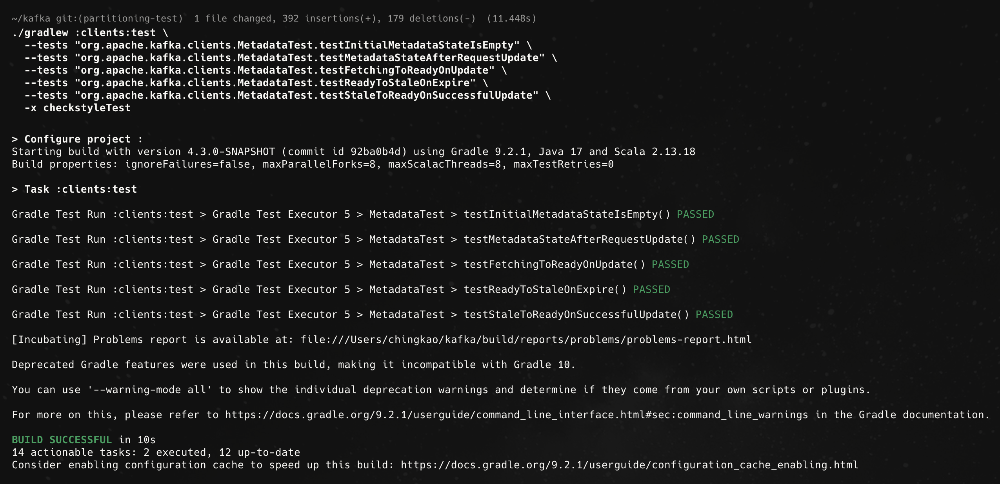

---


# Introduction to Structural Testing
## What is Structural testing?

Structural testing is the method used in white-box testing.

It is a verification technique that focuses on the **internal implementation of the software**. Unlike functional testing, which treats the system as a "black box," structural testing requires a transparent view of the source code.

It relies on the relationship between design and verification:
- **Structural Model :** provides the map of the internal logic.
- **Structural Testing :** uses that map to ensure every road (code path) is functional and safe. 

## What is the difference between Functional Models & Structural Models?

**Functional Models (Black-box perspective):** Represent the intended behavior and requirements of users. They focus on what the system does (Input/Output).

**Structural Models (White-box perspective):** Represent the code structure itself. They focus on how the system is implemented (Internal Logic).

## How to interpret our code throught Structural Models?

Structural models can be categorized into two types:

1. **Intraprocedural:** Focuses on the structure within a single procedure, function, or method.
  - Examples: Control Flow Graph (CFG).

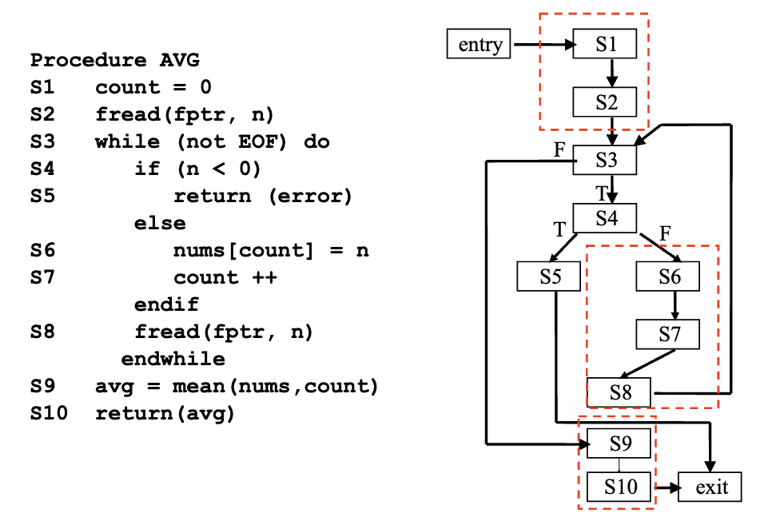
> The red-dashed blocks indicate basic blocks—a basic block is a sequence of consecutive statements where control flow enters at the beginning and exits at the end, with no possibility of branching or halting within the block. 
> 
> These sequences are grouped because their execution is linear and does not influence the decision points or branching in the overall control flow graph (CFG).

1. **Interprocedural:** Examines the relationships and interactions across multiple procedures or functions, including procedure calls and shared global variables.
  - Example: Call Graph.

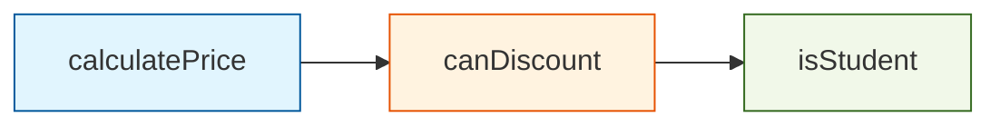
```java
public class TicketSystem {

    public boolean isStudent(String category) {
        return "STUDENT".equalsIgnoreCase(category);
    }

    public boolean canDiscount(String category, int age) {
        if (isStudent(category) || age < 18) {
            return true;
        }
        return false;
    }

    public double calculatePrice(double basePrice, String category, int age) {
        if (canDiscount(category, age)) {
            return basePrice * 0.8; 
        }
        return basePrice;
    }
}
```

## Why Structural testing is important?

Structural testing provides **a systematic way to verify software reliability**. Its importance lies in three key areas:

- **Automation:** Enables the use of automated tools to analyze code structure and generate tests.
- **Criteria:** Establishes clear metrics (like Code Coverage) to objectively decide when testing is "done."
- **Guidance:** Reveals hidden logic paths, guiding testers to write cases for scenarios that functional specs might miss.

# Evaluate Existing Test Coverage

**Target File:**  
`clients/src/main/java/org/apache/kafka/common/internals/Topic.java`

**Steps to Measure Test Coverage:**

1. **Clean previous build artifacts:**
```bash
./gradlew :clients:clean
```

2. **Run targeted tests with coverage enabled:**
```bash
./gradlew :clients:test \
    -PenableTestCoverage=true \
    -x checkstyleTest \
    --tests "*TopicTest" \
    --continue
```

3. **Generate the coverage report:**
```bash
./gradlew :clients:jacocoTestReport \
    -PenableTestCoverage=true \
    -x checkstyleTest \
    -x :clients:test
```
**Location of Coverage Report:**  
`clients/build/reports/jacoco/test/html/index.html`


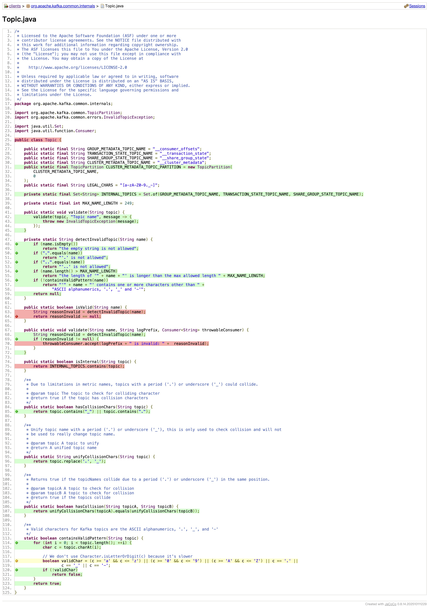

Based on the coverage report screenshots (notably the areas marked in red), the following sections of the `Topic.java` code are not exercised by the current test suite:

1. **Validate Error Handler (Critical)**
   - **Uncovered Statement:**  
     `throwableConsumer.accept(logPrefix + " is invalid: " + reasonInvalid);`
   - **What’s Missing:**  
     The block inside `if (reasonInvalid != null)` is never reached.
   - **Cause:**  
     Existing tests only supply valid topic names to `Topic.validate()`, resulting in `reasonInvalid` always being `null` and bypassing the error handler. To achieve coverage, tests must use invalid topic names (e.g., `"invalid@name"`) so this branch executes.

2. **`isInternal` Method**
   - **Uncovered Statement:**  
     `return INTERNAL_TOPICS.contains(topic);`
   - **What’s Missing:**  
     The logic that determines if a topic is classified as internal (such as `__consumer_offsets`) has not been tested.
   - **Cause:**  
     No test calls `Topic.isInternal()`; to increase coverage, this method should be invoked in test cases.

3. **`isValid` Method**
   - **Uncovered Statements:**  
     The complete implementation of `public static boolean isValid(String name)`.
   - **What’s Missing:**  
     The helper method that checks if a topic name is valid is untested.
   - **Cause:**  
     Tests currently invoke `detectInvalidTopic` or `validate` directly, skipping `isValid(String name)`. To cover this, write tests that call `isValid()` explicitly.


# Improve and Document Test Coverage

## Newly Added or Improved Test Cases

### Test Case Coverage Details

**Topic.isValid()**
- **Test: Valid Topic Name**
  - Ensures that `Topic.isValid()` returns `true` for a typical valid topic name.
- **Test: Invalid Topic Names**
  - Verifies that `Topic.isValid()` returns `false` for a variety of invalid topic name formats.

**Topic.validate**
- **Test: Invalid Topic Name Invokes Error Handler**
  - Confirms that the `throwableConsumer` error handler in `Topic.validate` is executed when provided an invalid topic name.

**Topic.isInternal()**
- **Test: Internal Topic Recognition**
  - Confirms that well-known internal topics such as `__consumer_offsets` are correctly marked as internal.
- **Test: Standard Topics Not Marked Internal**
  - Validates that regular user-defined topic names are not flagged as internal.
- **Test: Cluster Metadata Topic Not Marked Internal**
  - Checks that cluster metadata topics are not mistakenly identified as internal topics.
- **Test: Exception on Null Input**
  - Asserts that attempting to check if a `null` topic is internal results in the expected exception being thrown.


### Commands to Run the New and Updated Tests and Generate Coverage

```bash
# Run TopicTest with coverage enabled
./gradlew :clients:test \
    -PenableTestCoverage=true \
    -x checkstyleTest \
    --tests "*TopicTest" \
    --continue

# Generate the updated JaCoCo coverage report
./gradlew :clients:jacocoTestReport \
    -PenableTestCoverage=true \
    -x checkstyleTest \
    -x :clients:test
```

### Improved Coverage Report Screenshots


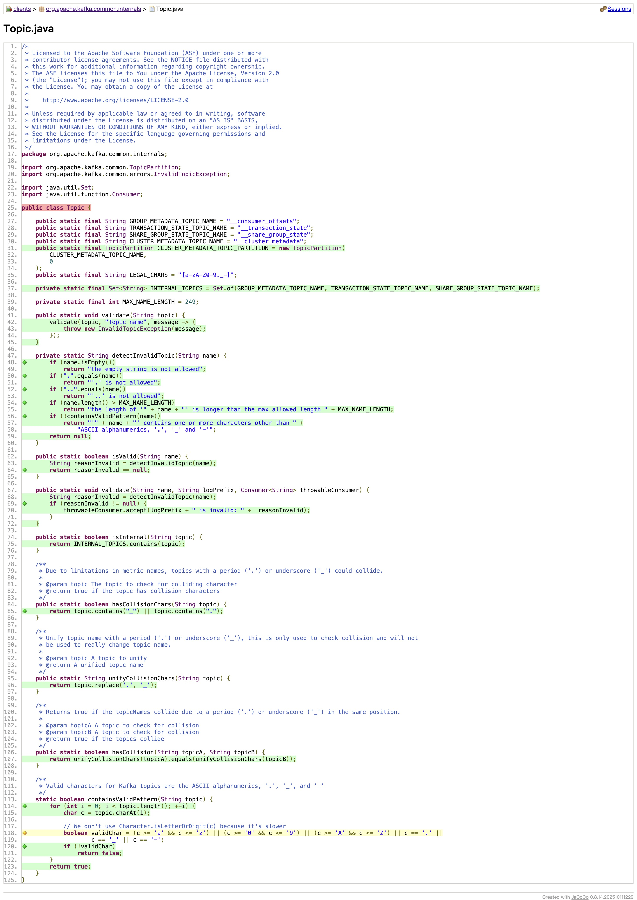

---


# What is Continuous Integration?

## **Integration** refers to the process of combining two or more software components, which are often parts of a larger project.

- When integrating systems, new issues often arise because these components may be interacting for the first time.
- If integration is not handled carefully, multiple problems can emerge simultaneously, making them difficult to diagnose, debug, and resolve.
- Interdependencies between modules can lead to a cascade of problems that are hard to isolate and fix individually.

## **Continuous Integration (CI)**

A modern software development practice where code changes are **automatically built and tested** whenever new code is committed—often several times a day.

### Key Aspects of Continuous Integration:

- **Frequent Integration:**  
Developers regularly merge their changes into the main branch, which triggers automated builds and tests.
- **Automated CI Tools:**  
Tools such as **Jenkins, TravisCI, and GitHub Actions** are used to automate building and testing, helping teams maintain high code quality with minimal manual oversight.
- **Immediate Feedback:**  
Each integration immediately reveals issues, making bugs and integration errors easier and faster to fix.

# Why CI is important for modern software development?

## Daily Builds

- The project is compiled into a working executable at least once daily—often after every commit.
- **Benefits:**
  - Provides an up-to-date view of the project's health.
  - Increases team confidence; there's always a working version available.
  - Facilitates rapid detection and resolution of build-breaking errors.
- This process should be **fully automated or executable by a simple script** for efficiency.
- **Improved predictability of development timelines**
- **Earlier detection of bugs and issues**
- **Enables frequent and reliable deployments**
- **Ensures users receive new features and updates more often**
- **Provides quicker feedback to developers**

# Setting Up a CI System

## Summary of CI Workflow Additions

**File:** `.github/workflows/clients-fsm-and-whitebox-tests.yml`

**Jobs Included:**

- **Finite State Machine Tests (`finite-state-machine-test`):**
  - Executes the five specified `MetadataTest` methods.
  - Command:  
    `./gradlew :clients:test`  
    with targeted `--tests` arguments for each `MetadataTest` method and `-x checkstyleTest`.

- **White Box Tests (`white-box-test`):**
  - Executes all `*TopicTest` classes.
  - Command:  
    `./gradlew :clients:test`  
    with `--tests "*TopicTest"`, `-PenableTestCoverage=true`, `-x checkstyleTest`, and `--continue` flags.

# Build issues encountered and how I resolved them.

## Problem 1:
The project initially contained too many original CI workflow files, which led to confusion and redundancy.


**Solution:**
- Replaced previous CI with a minimal placeholder workflow (`ci.yml`).
- Kept only the main test workflow (`clients-fsm-and-whitebox-tests.yml`), which runs both the finite state machine tests and white box tests.
- All other workflow files were removed.

## Problem 2:
Even after deleting the corresponding YAML files, some workflows were still being triggered.


**Solution:**

This issue occurred because I configured the CI workflow to trigger on pull requests targeting the `trunk` branch. 

However, GitHub Actions determines which workflows to run based on the branch that is the target of the pull request. This is designed to ensure that changes affecting protected branches, such as the main branch, are properly validated by the relevant workflows.

To resolve this, I merged my workflow changes into the `trunk` branch and verified that the CI process triggered as expected.


---


# Testable Design
## What are some aspects and goals that contribute to making a design testable?

A testable design allows components to be isolated, controlled, and observed independently with minimal setup and minimal dependency on external systems.

- Use Dependency Injection (DI)
  - Avoid: new inside a class.
  - Prefer: pass the instance as a parameter (ideally as an interface or abstraction).
- Avoid Complex private Methods
  - Private methods cannot be tested
  - complex logic in private methods can be a source for bugs that cannot be found by direct testing
- Loose Coupling
  - Avoid static Methods.
    - Static methods make it difficult to substitute dependencies during testing, especially when the method performs side effects (I/O, database access, randomness, time, etc.).
  - Avoid Logic in Constructors. 
    - You cannot instantiate the object without triggering that logic. 
    - Constructors should only initialize state.
  - Avoid Singleton Pattern
    - Singletons introduce global state, which reduces isolation and makes tests brittle and order-dependent.

## Stubbing
### Can you provide a case in your selected project that use stubbing?
<!-- Document how it is used and why you think it is used. -->

Mockito is used extensively for stubbing in kafka's tests. The typical pattern for stubbing with Mockito is:

`when(...).thenReturn(...)`

To identify usages of stubbing in our codebase, we can run:
```bash
grep -R "when(" clients/src/test/java
```
This returns several examples, such as:
- **KafkaProducerTest**
  - `when(metadata.fetch()).thenReturn(emptyCluster, emptyCluster, emptyCluster, emptyCluster, onePartitionCluster);`
  - `when(ctx.sender.isRunning()).thenReturn(true);`
  - `when(ctx.transactionManager.isPrepared()).thenReturn(true);`
- **ClientUtilsTest**
  - `when(inetAddress1.getCanonicalHostName()).thenReturn(canonicalHostname1);`
  - `inetAddress.when(() -> InetAddress.getAllByName(hostname));`
  - `when(mock.isUnresolved()).thenReturn(false);`

#### Using `metadata.fetch()` in KafkaProducerTest as example

```java
  public void testMetadataFetch(boolean isIdempotenceEnabled) throws InterruptedException {
    // ...

    ProducerMetadata metadata = mock(ProducerMetadata.class);

    // Return empty cluster 4 times and cluster from then on
    when(metadata.fetch())
      .thenReturn(emptyCluster, emptyCluster, emptyCluster, emptyCluster, onePartitionCluster);

    // ...
  }
```

- **How it is used:** `metadata.fetch()` is stubbed to return a predefined sequence of Cluster objects. Instead of calling the real implementation of metadata.fetch(), the test forces it to return controlled values.
- **Why it is used:** It returns hard-coded values and simplified logic to support testing
  - Isolate the unit under test
  - Avoid external dependencies

### Stub an existing method that is used in a test (you may use either the interface or subclass type). 
<!-- Duplicate an existing test or create a new one and in the new test implement it in a way that the stubbed method is used instead of the real one. -->

#### Original Tests:
```java
@Test
public void testInitialMetadataStateIsEmpty() {
    MockTime time = new MockTime();

    MetadataState state = getMetadataState(metadata, time.milliseconds());
    assertEquals(MetadataState.EMPTY, state, "Metadata should not request update at initialization");
}

//...

@Test
public void testUpdateMetadataAllowedImmediatelyAfterBootstrap() {
  MockTime time = new MockTime();

  Metadata metadata = new Metadata(refreshBackoffMs, refreshBackoffMaxMs,
          metadataExpireMs, new LogContext(), new ClusterResourceListeners());
  metadata.bootstrap(Collections.singletonList(new InetSocketAddress("localhost", 9002)));

  assertEquals(0, metadata.timeToAllowUpdate(time.milliseconds()));
  assertEquals(0, metadata.timeToNextUpdate(time.milliseconds()));
}
```

  -  In those case, we don’t care about the sleep mechanism; we only focus on the initial value of the time object, which makes them perfect examples for isolating time as a dependency.
  - `MockTime` provide a stonger implement than `Mockito` implement in kafka senario. However, those tests only require a fixed timestamp, so using a minimal stub improves clarity and reduces coupling to the MockTime implementation.

#### Refined Test:
```java
@Test
public void testInitialMetadataStateIsEmptyStubbingTime() {
    Time time = Mockito.mock(Time.class);
    long stubCurrentTime = System.currentTimeMillis();
    Mockito.when(time.milliseconds()).thenReturn(stubCurrentTime);

    MetadataState state = getMetadataState(metadata, time.milliseconds());

    assertEquals(MetadataState.EMPTY, state, "Metadata should not request update at initialization");
}

@Test
public void testUpdateMetadataAllowedImmediatelyAfterBootstrapStubbingTime() {
    Time time = Mockito.mock(Time.class);
    long stubCurrentTime = System.currentTimeMillis();
    Mockito.when(time.milliseconds()).thenReturn(stubCurrentTime);

    Metadata metadata = new Metadata(
        refreshBackoffMs,
        refreshBackoffMaxMs,
        metadataExpireMs,
        new LogContext(),
        new ClusterResourceListeners()
    );
    metadata.bootstrap(Collections.singletonList(new InetSocketAddress("localhost", 9002)));

    assertEquals(0, metadata.timeToAllowUpdate(time.milliseconds()));
    assertEquals(0, metadata.timeToNextUpdate(time.milliseconds()));
}
```


### How to Run?

```bash
./gradlew :clients:test \
  --tests "org.apache.kafka.clients.MetadataTest.testInitialMetadataStateIsEmptyStubbingTime" \
  --tests "org.apache.kafka.clients.MetadataTest.testUpdateMetadataAllowedImmediatelyAfterBootstrapStubbingTime" \
  -x checkstyleTest
```

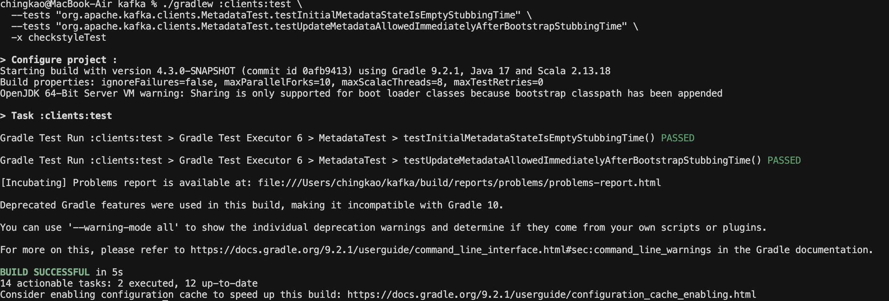

## Bad testable design

### Document that code in your report and describe what would be prevented with that code. Describe how you would advise to fix that code.

In the `Metadata` constructor, a new `ExponentialBackoff` is created directly. This isn't necessarily a bad design on its own, but it does make the code harder to test.

By having the `Metadata` class create its own `ExponentialBackoff` using specific configuration values, it hides the details of its retry logic inside the class. This means you can't easily swap in a different or mock version of `ExponentialBackoff` for testing purposes, which makes unit testing and isolating behaviors more difficult.

```java
public class Metadata implements Closeable {
  // ...
  public Metadata(long refreshBackoffMs,
                      long refreshBackoffMaxMs,
                      long metadataExpireMs,
                      LogContext logContext,
                      ClusterResourceListeners clusterResourceListeners) {
          this.log = logContext.logger(Metadata.class);
          this.refreshBackoff = new ExponentialBackoff(
              refreshBackoffMs,
              CommonClientConfigs.RETRY_BACKOFF_EXP_BASE,
              refreshBackoffMaxMs,
              CommonClientConfigs.RETRY_BACKOFF_JITTER);
          this.metadataExpireMs = metadataExpireMs;
          // ...
      }
  // ...
}
```

To improve testability and flexibility, we can inject the `ExponentialBackoff` instance into the `Metadata` class via its constructor (dependency injection), rather than creating it internally.

### Implement a new version of that code with the newer design.
[newer design](https://github.com/Oceankj/kafka/blob/3f75102fa70836f3010afbf1b553561e0cb7de82/clients/src/main/java/org/apache/kafka/clients/Metadata.java#L126-L146)
```java
public class Metadata implements Closeable {
  // ...
  public Metadata(ExponentialBackoff refreshBackoff,
                      long metadataExpireMs,
                      LogContext logContext,
                      ClusterResourceListeners clusterResourceListeners) {
          this.log = logContext.logger(Metadata.class);
          this.refreshBackoff = refreshBackoff;
          this.metadataExpireMs = metadataExpireMs;
          // ...
      }
  // ...
}
```

### Write a test case that executes the new, more testable code in a way that tests the newly testable functionality.
[testTimeToNextUpdateRetryBackoffWithNewConstructor](https://github.com/Oceankj/kafka/blob/3f75102fa70836f3010afbf1b553561e0cb7de82/clients/src/test/java/org/apache/kafka/clients/MetadataTest.java#L1498-L1529)

```bash
./gradlew :clients:test \
  --tests "org.apache.kafka.clients.MetadataTest.testTimeToNextUpdateRetryBackoffWithNewConstructor" \
  -x checkstyleTest
```

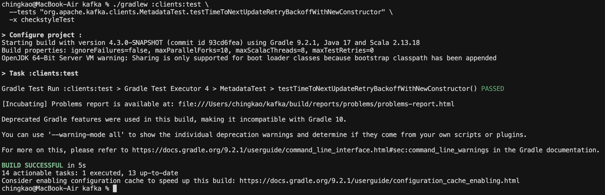


---

# Mocking
## Describe mocking and its utility. 

**Mock**: a fake object that verifies how it is used (method calls,
arguments)

#### Using `MockTime` in KafkaAdminClientTest as example
- **Purpose:** Provides a controllable implementation of the `Time` interface for tests, allowing the system clock to be advanced manually.
- **Example Implementation:**
  ```java
  /**
   * A clock that you can manually advance by calling sleep.
   */
  public class MockTime implements Time {
      // ...

      @Override
      public long milliseconds() {
          maybeSleep(autoTickMs);
          return timeMs.get();
      }

      // ...

      @Override
      public void sleep(long ms) {
          timeMs.addAndGet(ms);
          highResTimeNs.addAndGet(TimeUnit.MILLISECONDS.toNanos(ms));
          tick();
      }

      // ...
  }
  ```
- **Example Usage in Test:**
  ```java
    /**
     * Test if admin client can be closed in the callback invoked when
     * an api call completes. If calling {@link Admin#close()} in callback, AdminClient thread hangs
     */
    @Test
    @Timeout(10)
    public void testCloseAdminClientInCallback() throws InterruptedException {
        MockTime time = new MockTime();
        AdminClientUnitTestEnv env = new AdminClientUnitTestEnv(time, mockCluster(3, 0));

        final ListTopicsResult result = env.adminClient().listTopics(new ListTopicsOptions().timeoutMs(1000));
        final KafkaFuture<Collection<TopicListing>> kafkaFuture = result.listings();
        final Semaphore callbackCalled = new Semaphore(0);
        kafkaFuture.whenComplete((topicListings, throwable) -> {
            env.close();
            callbackCalled.release();
        });

        time.sleep(2000); // Advance time to timeout and complete listTopics request
        callbackCalled.acquire();
    }
  ```
- **Why this is useful:** 
  - Tests can simulate time passing in a deterministic way without waiting.
  - Helps isolate time-dependent logic by decoupling from the real system clock.
  - Makes tests faster and more reliable by avoiding race conditions or slow sleeps.

## Find a feature that could be mocked (that is not already) and would be good to be tested with mocking. Document this feature and how mocking would allow for a type of behavior checking not afforded without mocking. 

If we look inside `kafka/client`, we can find many mock-related classes such as `MockSerializer`, `MockPartitioner`, `MockProducerInterceptor`, `MockTime`, and `MockClient`. However, their implementations are slightly different from what we typically expect when using a mocking framework. Instead of using `Mockito.mock()` to create dynamic mocks, they tend to implement controllable fake objects.

Given this situation, it is difficult to find a feature that has not already been mocked under a strict definition of mocking. Therefore, the more practical approach is to identify cases where using `Mockito` would provide clearer behavioral verification or improved test expressiveness.

#### Using `testSerializerClose` as example
```java
    @Test
    public void testSerializerClose() {
        Map<String, Object> configs = new HashMap<>();
        configs.put(ProducerConfig.CLIENT_ID_CONFIG, "testConstructorClose");
        configs.put(ProducerConfig.BOOTSTRAP_SERVERS_CONFIG, "localhost:9999");
        configs.put(ProducerConfig.METRIC_REPORTER_CLASSES_CONFIG, MockMetricsReporter.class.getName());
        configs.put(CommonClientConfigs.SECURITY_PROTOCOL_CONFIG, CommonClientConfigs.DEFAULT_SECURITY_PROTOCOL);

        // Create two mock serializers.
        final int oldInitCount = MockSerializer.INIT_COUNT.get();
        final int oldCloseCount = MockSerializer.CLOSE_COUNT.get();

        // Construct a `KafkaProducer` using these serializers.
        try (var ignored = new KafkaProducer<>(configs, new MockSerializer(), new MockSerializer())) {

            assertEquals(oldInitCount + 2, MockSerializer.INIT_COUNT.get());
            assertEquals(oldCloseCount, MockSerializer.CLOSE_COUNT.get());
        }

        // Verify that both serializers' `close()` methods are invoked when the producer is closed.
        assertEquals(oldInitCount + 2, MockSerializer.INIT_COUNT.get());
        assertEquals(oldCloseCount + 2, MockSerializer.CLOSE_COUNT.get());
    }
```
This test checks that when you close a `KafkaProducer`, it also closes its serializers.

**Workflow:**
- When the producer is created, its serializer's `configure` method is called.
- When the producer is closed, its serializer's `close` method is called.

**Key points:**
- `KafkaProducer` does not care how the serializer is implemented.
- It also does not care how the serializer turns data into `byte[]`.

This means the test is focused on behavior: we just need to make sure that the appropriate methods (`configure` and `close`) are called on the serializers, regardless of their internal implementation.

| | Kafka current approach (`MockSerializer.CLOSE_COUNT.get()`) | Mockito approach (`verify(serializer).close()`) |
|-|-------------------------------------------------------------|-------------------------------------------------|
|Type of verification| state-based verification| interaction-based verification|
| Need to write a custom fake class | Yes | No |
| Need to maintain a static counter | Yes | No |
| Need to reset counter between tests | Yes | No |
| Risk of shared or global state | Yes | No |
| Test isolation | Poor (affected by global variables) | Good (each test isolated) |
| Expressiveness | Indirect—must observe counter change | Directly & clearly verifies method invocation |

In summary, the advantage of using Mockito is that it allows you to directly verify calls to object behavior, reducing boilerplate, improving test expressiveness, and enhancing isolation.


## Write a test case using Mockito that uses mocking to test that feature. 

[testSerializerCloseWithMockito](https://github.com/Oceankj/kafka/blob/93cd6feab1f40aa8ca2e84fc056cea00e98a3d70/clients/src/test/java/org/apache/kafka/clients/producer/KafkaProducerTest.java#L3366-L3382)

```bash
./gradlew :clients:test \
  --tests "org.apache.kafka.clients.producer.KafkaProducerTest.testSerializerCloseWithMockito" \
  -x checkstyleTest
```

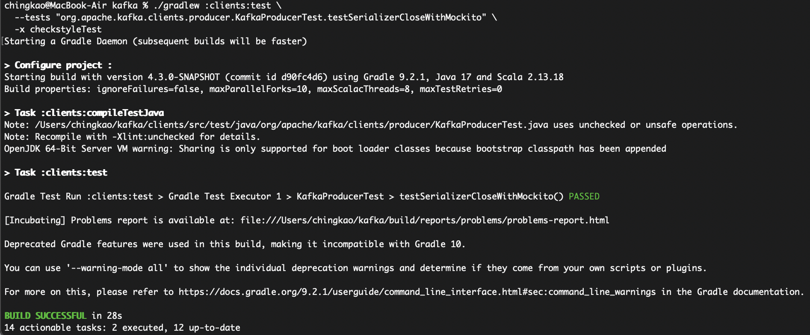

---


# Describe the goals, purposes, and use of static analysis tools

## Goal
The main goal of static analysis is to scan and analyze source code without actually running the program.

- **The "Grammarly" of Code:** Think of it like using a spell-checker on your essay before you hand it in. You are finding mistakes just by "reading" the text, rather than "executing" it.
- **Finding Problems Early:** We want to catch bugs as early in the development process as possible. Finding a bug while you are typing is much cheaper and easier to fix than finding it after the software is released!

## Purpose
- **Coding Style (Consistency):** It enforces a uniform coding style across the entire team (e.g., proper indentation, naming conventions). This makes the code highly readable, as if it were written by a single person.
- **Best Practices (Code Quality):** It automatically catches "bad smells" and silly mistakes. For example, it will flag unused variables, unreachable code, or poorly written loops. This allows developers to focus their Code Reviews on actual business logic rather than hunting for missed semicolons.
- **Security & Reliability:**
  - Security: It can track how user inputs flow through the program to prevent attacks like SQL Injection.
  - Reliability: It scans the control flow to predict where a program might crash, such as identifying potential Memory Leaks or Null Pointer Exceptions.

## Tools
- **Checkstyle:** Primarily used for Coding Standards. It checks if your Java code adheres to a specific formatting standard (like the Google Java Style Guide).
- **SpotBugs:** Focuses on Best Practices and Reliability. It analyzes Java bytecode to find common programming flaws, potential memory leaks, and performance issues.

# Github CodeQL's "standard findings" 


## Deep Dive into Specific Warnings: CodeQL Findings
CodeQL mainly focuses on finding **Security & Reliability** issues. Here are three interesting warnings we found, explained simply:

### Broken Security: Trusting All Certificates
- **What it is:** The code is set up to trust every security certificate without actually checking if it's real. It's like a security guard letting anyone into a building without checking their ID.
- **Is it an actual problem?** Yes. This allows a "Man-in-the-Middle" (MITM) attack, where a hacker can easily spy on or change the data being sent. Developers often do this temporarily just to make local testing easier, but forgetting to remove it before the software goes live is very dangerous.

### Path Traversal: Trusting User Input for File Paths
- **What it is:** The code takes input from a user and uses it directly to open a file, without cleaning or checking the input first.
- **Is it an actual problem?** Yes. This is a type of Injection attack called "Path Traversal." A hacker could type something like ../../ to "climb out" of the intended folder and read secret system files or passwords that they shouldn't have access to.

### App Crash (DoS): Bad Regular Expressions (ReDoS)
- **What it is:** The code uses a poorly written "regular expression" (a search pattern) to check user input.
- **Is it an actual problem?** Yes. If a hacker intentionally sends a very tricky string of text, the system gets stuck in an endless loop trying to process it. This cause a Denial of Service (DoS) that freezes the app and locks out normal users.

# SpotBugs Static Analysis

## Running SpotBugs

To analyze the codebase with SpotBugs, run:
```
./gradlew :clients:spotbugsMain
```

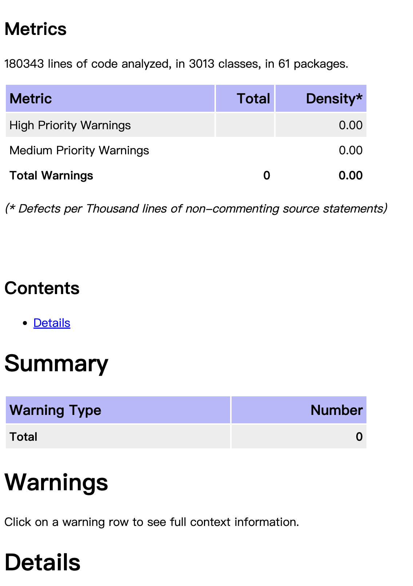

## Why Are There Zero Warnings?

At first glance, it seems surprising that such a large project would have zero SpotBugs warnings. This can be explained by examining Kafka's SpotBugs configuration:

```
spotbugs {
  toolVersion = versions.spotbugs
  excludeFilter = file("$rootDir/gradle/spotbugs-exclude.xml")
  ignoreFailures = false
}
```

Kafka employs a strict exclusion filter for SpotBugs findings, as configured in `spotbugs-exclude.xml`:

```xml
<FindBugsFilter>
    <Match>
        <!-- Suppress warnings about exposing mutable objects and public fields -->
        <Bug pattern="EI_EXPOSE_REP,EI_EXPOSE_REP2,MS_PKGPROTECT,EI_EXPOSE_STATIC_REP2,MS_EXPOSE_REP"/>
    </Match>
    <Match>
        <!-- Temporarily suppress warnings about System.exit -->
        <Bug pattern="DM_EXIT"/>
    </Match>
    <!-- skip  -->
</FindBugsFilter>
```

These exclusions are used to suppress known false positives and to accommodate certain intentional design decisions in the Kafka project.

## What Happens Without the Exclusion Filter?

When the exclusion rules are commented out in `build.gradle`:

```
spotbugs {
  toolVersion = versions.spotbugs
  // excludeFilter = file("$rootDir/gradle/spotbugs-exclude.xml")
  ignoreFailures = true
}
```

SpotBugs reports many more findings:

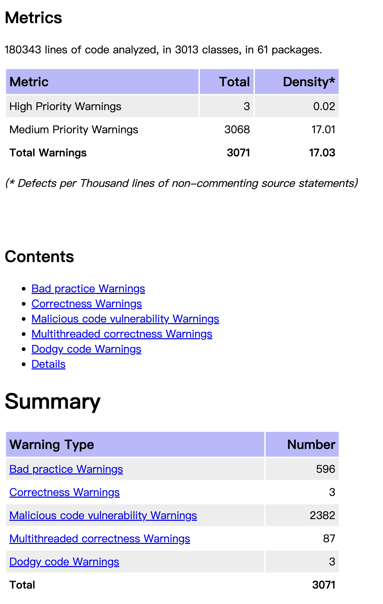

## Examining the Findings

Digging deeper into the raw report:

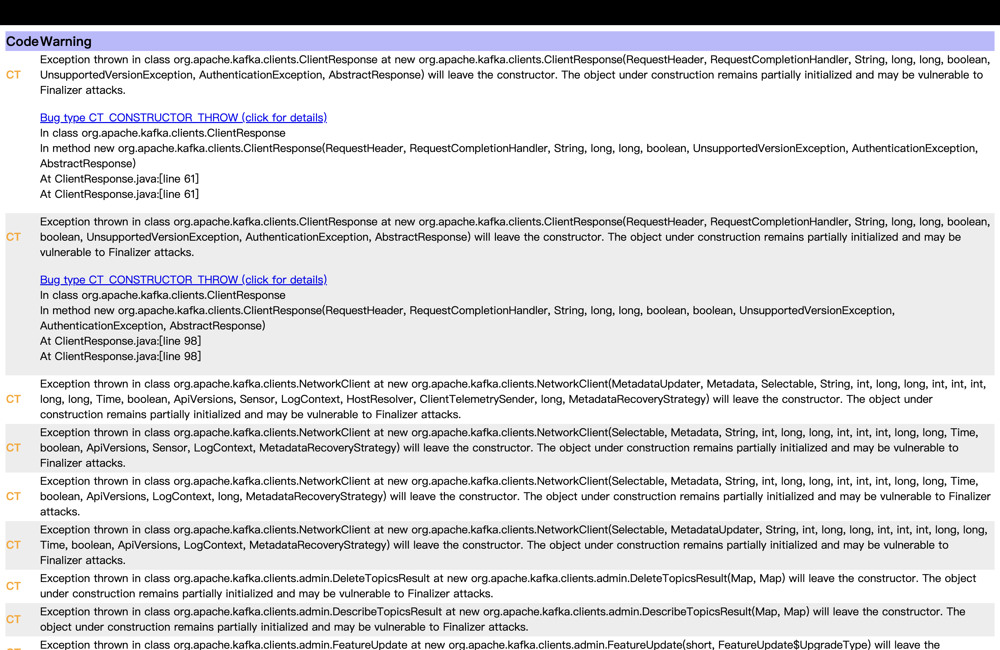

A significant number of findings are of type `CT_CONSTRUCTOR_THROW`, indicating constructors that may throw exceptions. This is illustrated in Kafka by patterns like:

```java
try {
   ...
} catch (Throwable t) {
   close(...)
   throw new KafkaException(...)
}
```

### Why is throwing exceptions from constructors discouraged?
- It can leave objects in a partially constructed or uninitialized state.
- Debugging becomes more challenging when failures occur during construction.
- If resources (such as memory, files, or network connections) are allocated before the failure, there is an increased risk of resource leaks.

### Why does Kafka intentionally use this design in some cases?

Despite this general guideline, Kafka intentionally allows constructors to throw exceptions in some cases. This is because components such as KafkaProducer or KafkaConsumer perform complex initialization steps, including network setup, configuration validation, and resource allocation.

If any of these initialization steps fail, it is safer to prevent the object from being created at all. Throwing an exception during construction ensures that the caller immediately knows the initialization has failed, rather than creating an object that is unusable.

In addition, Kafka typically performs cleanup before rethrowing the exception (e.g., calling close()), which reduces the risk of resource leaks.

# Summary

| Tool      | Focus Areas                                                                                       | Strengths                                                                   |
|-----------|---------------------------------------------------------------------------------------------------|-----------------------------------------------------------------------------|
| CodeQL    | Security and reliability vulnerabilities            | Excels at identifying complex patterns such as data flow issues, injection risks, and unsafe API usage |
| SpotBugs  | Code quality, best practices and detection of potential bug patterns                 | Detects issues like bad coding practices, multithreading problems, and questionable design choices     |

- In the Kafka project, most SpotBugs warnings are intentionally suppressed using an exclusion filter (`spotbugs-exclude.xml`). This indicates that the project maintainers are aware of certain patterns but have decided that they are acceptable for their design goals.

- When the exclusion filter is disabled, SpotBugs reports a large number of findings such as `CT_CONSTRUCTOR_THROW`, showing that static analysis tools can sometimes flag intentional design decisions as potential issues.

- This demonstrates a key limitation of static analysis: tools can highlight suspicious patterns, but human judgment is still required to determine whether the pattern is truly problematic or a deliberate design choice.